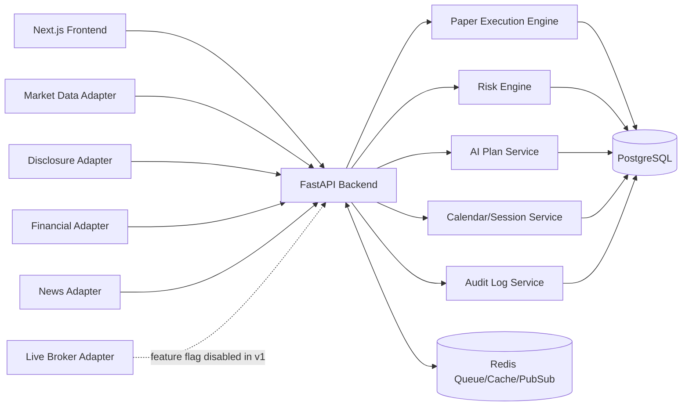

# Architecture Diagram

```mermaid
flowchart LR
  UI[Next.js Frontend] --> API[FastAPI Backend]
  API --> RISK[Risk Engine]
  API --> EXEC[Paper Execution Engine]
  API --> AI[AI Plan Service]
  API --> CAL[Calendar/Session Service]
  API --> AUDIT[Audit Log Service]

  EXEC --> PG[(PostgreSQL)]
  RISK --> PG
  AI --> PG
  CAL --> PG
  AUDIT --> PG

  API <--> REDIS[(Redis Queue/Cache/PubSub)]

  AD1[Market Data Adapter] --> API
  AD2[Disclosure Adapter] --> API
  AD3[Financial Adapter] --> API
  AD4[News Adapter] --> API

  LIVE[Live Broker Adapter]
  LIVE -.feature flag disabled in v1.-> API
```
